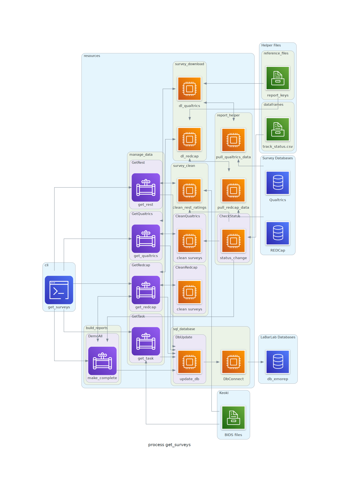
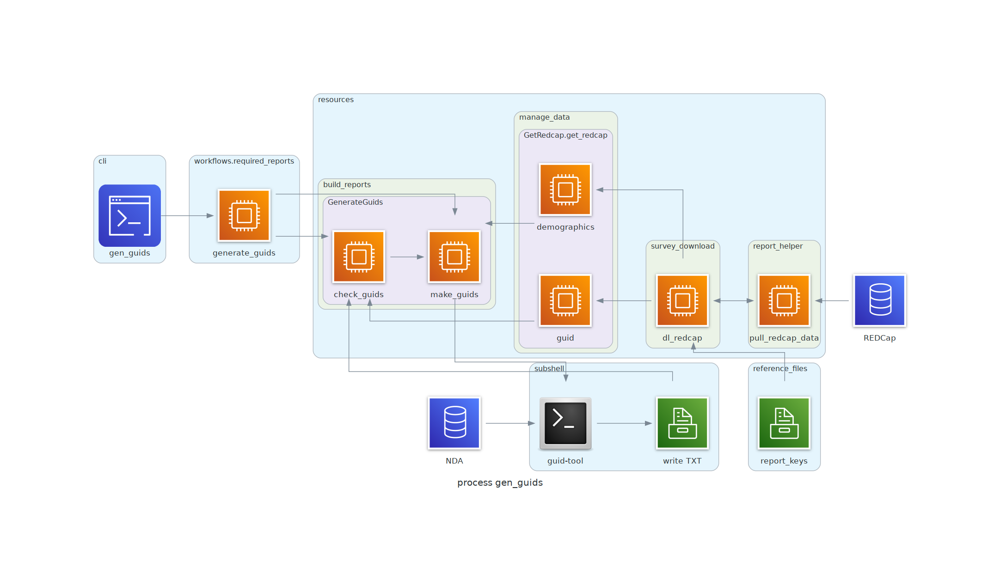

# make_reports
This package contains workflows for managing survey and task participant responses, generating reports, tracking data, and calculating basic descriptive statistics. Generally, each workflow downloads or finds original raw data, aggregates and cleans the data as appropriate, updates the MySQL database `db_emorep`, and then generates the report.

Sub-package/workflow navigation:
- [rep_get](#rep_get) : Download, aggregate, and clean survey and task responses
- [rep_regular](#rep_regular) : Generate demographic reports submitted to Duke and NIH
- [rep_ndar](#rep_ndar) : Generate reports and dataset submitted to the NDA
- [rep_metrics](#rep_metrics) : Make demographic, progress snapshots to aid acquisition
- [chk_data](#chk_data) : Check EmoRep and Archival MRI analysis pipelines progress
- [sur_stats](#sur_stats) : Compute descriptve stats and generate plots for participant responses
- [gen_guids](#gen_guids) : Generate and check participant GUIDs


## General Usage
- Install into project environment on labarserv2 (see [here](https://github.com/labarlab/conda_labarserv2)) via `$python setup.py install`.
- Trigger general package help and usage via entrypoint `$make_reports`.

```
(emorep)[nmm51-vm: day2_movies]$make_reports

Version : 2.3.0

The package make_reports consists of several sub-packages
that can be accessed from their respective entrypoints (below).

    rep_get     : Download and clean RedCap and Qualtrics surveys,
                    aggregate task and rest ratings
    rep_regular : Generate regular reports submitted by lab manager
    rep_ndar    : Generate reports for NDAR submission
    rep_metrics : Generate snapshots of the data to aid acquisition
    chk_data    : Check EmoRep and Archival data completeness,
                    pipeline progress.
    sur_stats   : Get descriptive stats and plots for surveys and task
    gen_guids   : Generate and check GUIDs
```


## General Requirements
Various workflows will require one or more of the following:
- An API token for the REDCap (see [here](https://portal.redcap.yale.edu/sites/default/files/files/FAQs/APIToken_v1_0.pdf)) project EmoRep_fMRI (PID 11938) accessible via `$PAT_REDCAP_EMOREP`
- An API token to Qualtrics (see [here](https://www.qualtrics.com/support/integrations/api-integration/overview/)) accessible via `$PAT_QUALTRICS_EMOREP`
- User password to MySQL database `db_emorep` (see [here](https://labarlab.github.io/databases.html#create_account)) accessible via `$SQL_PASS`

Example:

```bash
$echo MY-PAT-FOR-REDCAP > ~/.ssh/pat_redcap_emorep
$echo 'export PAT_REDCAP_EMOREP=$(cat ~/.ssh/pat_redcap_emorep)' >> ~/.bashrc
```


## rep_get
This workflow downloads, aggregates, and cleans participant surveys and task responses. Data are then uploaded to their respective table in MySQL database `db_emorep`.

Additionally, dataframes are written to the EmoRep data structure at /mnt/keoki/experiments2/EmoRep/Exp2_Compute_Emotion/data_survey and organized by visit. Original downloads from REDCap and Qualtrics are titled 'raw_\*.csv' while cleaned dataframes are titled 'df_\*.csv'. See below for directory tree. Cleaned data from tasks conducted in the scanner are stored in the BIDS structure at /mnt/keoki/experiments2/EmoRep/Exp2_Compute_Emotion/data_scanner_BIDS/rawdata.

```
data_survey
├── redcap
│   ├── df_guid.csv
│   └── raw_guid.csv
├── visit_day1
│   ├── df_AIM.csv
│   ├── df_ALS.csv
│   ├── df_ERQ.csv
│   ├── df_PSWQ.csv
│   ├── df_RRS.csv
│   ├── df_STAI_Trait.csv
│   ├── df_TAS.csv
│   └── raw_EmoRep_Session_1.csv
├── visit_day2
│   ├── df_BDI.csv
│   ├── df_in_scan_ratings.csv
│   ├── df_PANAS.csv
│   ├── df_post_scan_ratings.csv
│   ├── df_rest-ratings.csv
│   ├── df_STAI_State.csv
│   ├── raw_bdi_day2.csv
│   ├── raw_FINAL - EmoRep Stimulus Ratings - fMRI Study.csv
│   └── raw_Session 2 & 3 Survey.csv
└── visit_day3
    ├── df_BDI.csv
    ├── df_in_scan_ratings.csv
    ├── df_PANAS.csv
    ├── df_post_scan_ratings.csv
    ├── df_rest-ratings.csv
    ├── df_STAI_State.csv
    └── raw_bdi_day3.csv
```


### Setup
- Generate and store API tokens for REDCap and Qualtrics in user environment (see [above](#general-requirements)).
- Store MySQL password for `db_emorep` in user environment.


### Usage
Trigger sub-package help and usage via `$rep_get`:

```
(emorep)[nmm51-vm: ~]$rep_get
usage: rep_get [-h] [--get-demographics] [--get-redcap] [--get-qualtrics] [--get-rest] [--get-task] [--proj-dir PROJ_DIR]

Download and clean survey data.

Download RedCap and Qualtrics data, and aggregate all rest-rating
and task responses. Clean dataframes, and write raw and clean dataframes
to <proj-dir>/data_survey according to visit. Also update relevant
tables in db_emorep.

Notes
-----
* requires global variable 'SQL_PASS' in user environment, which holds
    user password to mysql db_emorep database.
* --get-redcap requires global variable 'PAT_REDCAP_EMOREP' in user
    env, which holds the personal access token to the emorep REDCap database.
* --get-qulatrics requires global variable 'PAT_QUALTRICS_EMOREP' in
    user env, which holds the personal access token to the emorep
    Qualtrics database.

Example
-------
rep_get \
    --get-redcap \
    --get-qualtrics \
    --get-rest \
    --get-task \
    --get-demographics

optional arguments:
  -h, --help           show this help message and exit
  --get-demographics   Download and clean demographic info
  --get-redcap         Download and clean RedCap surveys
  --get-qualtrics      Download and clean Qualtrics surveys
  --get-rest           Clean and aggregate resting state ratings
  --get-task           Clean and aggregate task ratings
  --proj-dir PROJ_DIR  Path to project's experiment directory
                       (default : /mnt/keoki/experiments2/EmoRep/Exp2_Compute_Emotion)
```


### Considerations
This workflow is not unique and the same processes are utilized by other workflows (e.g. [rep_ndar](#rep_ndar)) -- accordingly it is not necessary to trigger this workflow before running others. This was added merely as a way of updating cleaned data on Keoki and `db_emorep` without needing to generate reports.


## rep_regular
This workflow generates reports required regularly by the NIH and Duke. Individual reports are requested by specifying the name of the institution + the frequency in months, e.g. a report submitted to the NIH every 12 months is requested via `--names nih12`.

Generated reports are written to /mnt/keoki/experiments2/EmoRep/Exp2_Compute_Emotion/documents/regular_reports and named according to the instute and date range covered:

```
documents/regular_reports/
├── report_duke12_2023-09-30_2024-06-30.csv
├── report_duke3_2023-07-01_2023-09-30.csv
├── report_nih12_2020-04-01_2024-03-31.csv
└── report_nih4_2020-06-30_2024-07-31.csv

```


### Setup
- Generate and store API tokens for REDCap in user environment (see [above](#general-requirements)).
- Store MySQL password for `db_emorep` in user environment.


### Usage
Trigger sub-package help and usage via `$rep_regular`:

```
(emorep)[nmm51-vm: ~]$rep_regular
usage: rep_regular [-h] [--proj-dir PROJ_DIR] [--query-date QUERY_DATE] --names {nih4,nih12,duke3,duke12}
                   [{nih4,nih12,duke3,duke12} ...]

Generate regular reports.

Mine RedCap demographic information to construct reports regularly
submitted to the NIH or Duke.

Notes
-----
- Requires global variable 'PAT_REDCAP_EMOREP' in user env, which
    holds the personal access token to the emorep REDCap database.
- Previous submissions can also be generated via --query-date.
- Reports are written to <proj_dir>/documents/regular_reports

Examples
--------
rep_regular --names nih4 nih12 duke12
rep_regular --names nih4 --query-date 2022-06-29

optional arguments:
  -h, --help            show this help message and exit
  --proj-dir PROJ_DIR   Path to project's experiment directory
                        (default : /mnt/keoki/experiments2/EmoRep/Exp2_Compute_Emotion)
  --query-date QUERY_DATE
                        YYYY-MM-DD format, after 2022-04-01.
                        Used to find a submission window e.g. 2022-06-06
                        would find all data between 2022-01-01 and 2022-12-31
                        when doing an annual report.
                        (default : today's date (2024-03-08))

Required Arguments:
  --names {nih4,nih12,duke3,duke12} [{nih4,nih12,duke3,duke12} ...]
                        List of desired reports to generate
```


### Considerations
- While the generation of previous reports is supported, the `--query-date` must be after 2022-03-31.
- Depending on the report, 'other' responses to the race prompts require manual adjustment.


## rep_ndar
This workflow generates datasets and reports required for the biannual NDAR upload. Reports are written to /mnt/keoki/experiments2/EmoRep/Exp2_Compute_Emotion/ndar_upload/cycle_* and associated data to /mnt/keoki/experiments2/EmoRep/Exp2_Compute_Emotion/ndar_upload/data_[beh|mri|phys]. Additionally, reports are organized in a sub-directory named for the submission date of the cycle. For instance, reports due for the 2023-12-01 to 2024-06-01 are saved in the directory cycle_2024-01-01:

```
ndar_upload/cycle_2024-06-01/
├── affim01_dataset.csv
├── als01_dataset.csv
├── bdi01_dataset.csv
├── brd01_dataset.csv
├── demo_info01_dataset.csv
├── emrq01_dataset.csv
├── iec01_dataset.csv
├── image03_dataset.csv
├── ndar_subject01_dataset.csv
├── panas01_dataset.csv
├── pswq01_dataset.csv
├── restsurv01_dataset.csv
├── rrs01_dataset.csv
├── stai01_dataset.csv
└── tas01_dataset.csv
```


### Setup
- Generate and store API tokens for REDCap and Qualtrics in user environment (see [above](#general-requirements)).
- Store MySQL password for `db_emorep` in user environment.


### Usage
Trigger sub-package help and usage via `$rep_ndar`:

```
(emorep)[nmm51-vm: ~]$rep_ndar
usage: rep_ndar [-h] [--proj-dir PROJ_DIR] [--report-all] [--report-names REPORT_NAMES [REPORT_NAMES ...]] -c CLOSE_DATE

Generate NDAR reports for EmoRep project.

Organize project data and generate reports for regular
NDAR submissions. Reports are written to:
    <proj_dir>/ndar_upload/cycle_<close_date>

Required data (e.g. image03) are copied to:
    <proj_dir>/ndar_upload/data_<foo>

Notes
-----
* Available reports:
    affim01, als01, bdi01, brd01, demo_info01, emrq01,
    image03, panas01, pswq01, restsurv01, rrs01,
    stai01, tas01
* Requires global variables 'PAT_REDCAP_EMOREP' and
    'PAT_QUALTRICS_EMOREP' in user env, which hold the
    personal access tokens to the emorep REDCap and
    Qualtrics databases, respectively.

Examples
--------
rep_ndar -c 2022-12-01 --report-names demo_info01 affim01
rep_ndar -c 2022-12-01 --report-all

optional arguments:
  -h, --help            show this help message and exit
  --proj-dir PROJ_DIR   Path to project's experiment directory
                        (default : /mnt/keoki/experiments2/EmoRep/Exp2_Compute_Emotion)
  --report-all          Make all planned NDA reports.
                        True if "--report-all" else False.
  --report-names REPORT_NAMES [REPORT_NAMES ...]
                        Make specific NDA reports by name.
                        e.g. --report-names affim01 als01

Required Arguments:
  -c CLOSE_DATE, --close-date CLOSE_DATE
                        YYYY-MM-DD format.
                        Close date for NDAR submission cycle, e.g.
                        "--close-date 2022-12-01" for 2023-01-15
                        submission. Used to submit data from
                        participants in the correct cycle.

```


### Considerations
- The file `make_reports.dataframes.track_status.csv` is curated manually.
- Report column names are derived from `make_reports.reference_files.*_template.csv`.


## rep_metrics
This workflow generates snapshots of data to aid recruitment efforts, including demographics distrubtion, particpant retention, and scan pacing. Output files are written to /mnt/keoki/experiments2/EmoRep/Exp2_Compute_Emotion/analyses/metrics_recruit and named according to the data type and method of ploting:

```
analyses/metrics_recruit/
├── plot_epi-motion_boxplot-double.png
├── plot_flow-participant
├── plot_flow-participant.png
├── plot_recruit-all_barplot.png
├── plot_recruit-female_barplot.png
├── plot_recruit-male_barplot.png
└── plot_scan-attempts_barplot-wide.png
```

### Setup
- Generate and store API token for REDCap (see [above](#general-requirements)).
- First-level output of [func_model](https://github.com/labarlab-emorep/func_model) in EmoRep data structure (if using `--prop-motion`).


### Usage
Trigger sub-package help and usage via `$rep_metrics`:

```
(emorep)[nmm51-vm: ~]$rep_metrics
usage: rep_metrics [-h] [--participant-flow] [--proj-dir PROJ_DIR] [--prop-motion] [--recruit-demo] [--scan-pace]

Generate descriptive metrics about recruitment.

Make plots and reports to give snapshots of the data:
    -   recruit-demo : Mine REDCap demographics to compare the
            actual enrolled demographic profile versus the
            proposed to help curtail under-representation.
    -   scan-pace : Quantify and plot the number of scans
            attempted each week, to help understand recruitment
            pace and adjustments.
    -   participant-flow : Draw PRISMA flowchart of participant
            flow, exclusion, lost-to-follow-up, and withdrawal
            for Experiment2
    -   prop-motion : Calculate the proportion of volumes that
            exceed framewise displacement thresholds.

Plots and reports are written to:
    <proj-dir>/analyses/metrics_recruit

Notes
-----
Options --recruit-demo, --participant-flow, --scan-pace require
global variable 'PAT_REDCAP_EMOREP' in user env, which holds the
personal access token to the emorep REDCap database.

Examples
--------
rep_metrics --prop-motion
rep_metrics --recruit-demo
rep_metrics --participant-flow
rep_metrics --scan-pace

optional arguments:
  -h, --help           show this help message and exit
  --participant-flow   Draw participant PRISMA flowchart
  --proj-dir PROJ_DIR  Path to project's experiment directory
                       (default : /mnt/keoki/experiments2/EmoRep/Exp2_Compute_Emotion)
  --prop-motion        Calculate proportion of volumes that exceed FD threshold
  --recruit-demo       Calculate recruitment demographics
  --scan-pace          Plot weekly scanning pace
```


### Considerations
- The file `make_reports.dataframes.track_status.csv` is curated manually.


## chk_data
This workflow checks BIDS derivatives for exepcted pipeline output for both EmoRep and Archival datasets. A progress dataframe is generated in `derivatives/track_data/<project>_pipeline_progress.csv` which contains:
- a datetime.date of when the files were last generated if all expected data are found, or
- the number of files encountered which did not meet expectations, or
- NaN if no files are found


### Setup
Execute workflows that write output to the EmoRep data structure.


### Usage
Trigger sub-package help and usage via `$chk_data`:

```
(emorep)[nmm51-vm: ~]$chk_data
usage: chk_data [-h] [--complete] [--project {emorep,archival}]

Conduct data checking for EmoRep and Archival data.

Compare detected files against known lists to identify
participants with missing data (survey, scanner) or need
processing of MRI data.

Notes
-----
- Written to be executed on the local VM labarserv2
- Assumes EmoRep data structure

Examples
--------
chk_data --project emorep
chk_data --project emorep --complete
chk_data --project archival

optional arguments:
  -h, --help            show this help message and exit
  --complete            Check for expected EmoRep survey and scanner files
  --project {emorep,archival}
                        Name of project to check for MRI processing output
```


### Considerations
- Checked files for EmoRep can be adjusted in `make_reports.resources.check_data._CheckEmorep.info_emorep`.
- Checked files for Archival can be adjusted in `make_reports.resources.check_data.CheckMri._info_archival`.


## sur_stats
This workflow generates descriptive statistics for participant survey and task responses. Output tables and figures are written to /mnt/keoki/experiments2/EmoRep/Exp2_Compute_Emotion/analyses/metrics_surveys.


### Setup
- Generate and store API token for REDCap and Qualtrics (see [above](#general-requirements)).


### Usage
Trigger sub-package help and usage via `$sur_stats`:

```
(emorep)[nmm51-vm: ~]$sur_stats
usage: sur_stats [-h] [--draw-plots] [--make-tables] [--proj-dir PROJ_DIR] [--survey-all]
                 [--survey-avail] [--survey-names SURVEY_NAMES [SURVEY_NAMES ...]]
                 [--write-json]

Generate descriptives for survey data.

Download, clean, and calculate descriptive statistics and plots
for REDCap, Qualtrics, rest-ratings, and stim-ratings surveys.

Output files are written to:
    <proj_dir>/analyses/metrics_surveys

Notes
-----
* Appropriate database tokens required, defined in user env via
    'PAT_REDCAP_EMOREP' and/or 'PAT_QUALTRICS_EMOREP'.
* General descriptive stats, all data are included.

Examples
--------
sur_stats --survey-avail
sur_stats --survey-all --draw-plots
sur_stats --survey-names AIM ALS stim --write-json
sur_stats --survey-names rest task --write-json --draw-plots
sur_stats --make-tables --draw-plots

optional arguments:
  -h, --help            show this help message and exit
  --draw-plots          Whether figures should be generated.
                        True if "--draw-plot" else False.
  --make-tables         Whether to compile generated dataframes into tables. Uses
                        data from all surveys available (similar to --survey-all).
                        Replaces --survey-list.
                        True if "--make-table" else False.
  --proj-dir PROJ_DIR   Path to project's experiment directory
                        (default : /mnt/keoki/experiments2/EmoRep/Exp2_Compute_Emotion)
  --survey-all          Generate descriptive statistics and draw plots
                        for all surveys. Replaces --survey-list.
                        See --survey-avail for list.
  --survey-avail        Print list of surveys availble for descriptive statistics.
  --survey-names SURVEY_NAMES [SURVEY_NAMES ...]
                        Requres --draw-plots or --write-json.
                        List of surveys, for generating descriptive statistics
                        and drawing figures. See --survey-avail for list.
  --write-json          Whether write Qualtrics and RedCap descriptive
                        stats out to JSON file.
```


### Considerations
Generated stats, tables, and plots include data from all participants.


## gen_guids
This workflow downloads REDCap demographic information to use in conjunction with the NDA's `guid-tool` for the purpose of generating participant GUIDs. These GUIDs are written to /mnt/keoki/experiments2/EmoRep/Exp2_Compute_Emotion/data_survey/redcap/output_guid_*.txt. It can also check for GUID copy-paste errors by comparing generated GUIDs with those in REDCap.


### Setup
- Install the `guid-tool`(see [here](https://nda.nih.gov/nda/nda-tools)) into OS.
- Update PATH with the guid-tool install location (e.g. `$export PATH=${PATH}:/opt/nda_guid`).
- Generate and store API token for REDCap (see [above](#general-requirements)).


### Usage
Trigger sub-package help and usage via `$gen_guids`:

```
(emorep)[nmm51-vm: ~]$gen_guids
usage: gen_guids [-h] [--find-mismatch] [--proj-dir PROJ_DIR] -n USER_NAME

Generate GUIDs for EmoRep.

Utilize RedCap demographic information to generate a batch
of GUIDs using the NDA's guid-tool for linux. Compare generated
GUIDs to those in RedCap survey.

Generated GUIDs are written to:
    <proj_dir>/data_survey/redcap/output_guid_*.txt

Notes
-----
Requires global variable 'PAT_REDCAP_EMOREP' in user env, which
holds the personal access token to the emorep REDCap database.

Examples
--------
gen_guids -n nmuncy
gen_guids -n nmuncy --find-mismatch

optional arguments:
  -h, --help            show this help message and exit
  --find-mismatch       Check for mismatches between generated
                        GUIDs and those in the RedCap survey.
  --proj-dir PROJ_DIR   Path to project's experiment directory
                        (default : /mnt/keoki/experiments2/EmoRep/Exp2_Compute_Emotion)

Required Arguments:
  -n USER_NAME, --user-name USER_NAME
                        NDA user name

```


### Considerations
- Your password length will not appear (for security purposes).
- Only 5 failed password attemps may occur before your NDA account is locked!


## Diagrams


### Module Imports
Diagram of imports.


### Schema: rep_get
Schematic mapping the `rep_get` workflow to specific modules and methods of `make_reports`.



### Schema: rep_regular
Schematic mapping the `rep_regular` workflow to specific modules and methods of `make_reports`.


### Schema: rep_ndar
Schematic mapping of `rep_ndar` workflow to specific modules and methods of `make_reports`.


### Schema: rep_metrics
Schematic mapping the `rep_metrics` workflow to specific modules and methods of `make_reports`.


### Schema: chk_data
Schematic mapping the `chk_data` workflow to specific modules and methods of `make_reports`.


### Schema: gen_guids
Schematic mapping the `gen_guids` workflow to specific modules and methods of `make_reports`.

